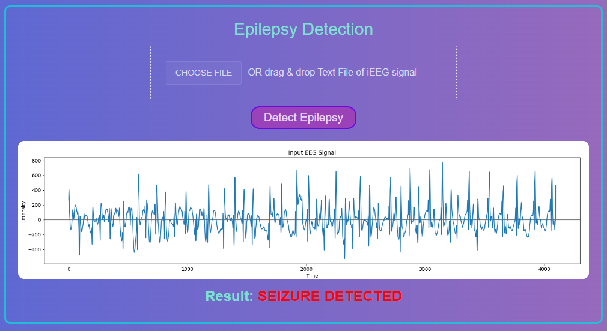

# Epilepsy_Detection_and_Localization

Epilepsy is a long-term neurological condition that affects the brain. It is identified by the recurrence of abnormal electrical activities in the brain called seizures which is captured using Intracranial Electroencephalogram (iEEG) technique. It is a time consuming and error-prone process to detect seizure activity and to localize the seizure focus using visual subjective discrimination manually. In this project, the BONN Dataset is used for analysis. 

For detecting the seizure activity in the signal, a number of deep learning techniques like LSTM, GRU and 1D CNN have been trained and tested. Similarly for the purpose of localization the key features in the signal are extracted using an autoencoder whose output is then fed to various classification algorithms like KNN, adaptive gradient boosting, random forest, logistic regression, SVM, MLP and 1D CNN. In addition to the aforementioned workflow for the localization of iEEG signals, RNN based Transformer approach was implemented. 

## Dataset Description:
The BONN dataset is commonly used for identifying epileptic seizures in the field of intracranial electroencephalogram (iEEG) research. It is composed up of iEEG recordings from five different patients. The information was gathered at the University Hospital of Bonn in Germany and made available to the public for research purposes. It comprises of five sets of iEEG recordings labelled A, B, C, D, and E, each with 100 signals. The signals are captured at a sample rate of 173.61 Hz over 16 channels. Each iEEG recording in the Bonn dataset is a 23.6 second segment of EEG activity, yielding 4097 data points. 

Each set is described briefly below: 
- Set A: This set contains surface EEG recordings of healthy patients with eyes open
- Set B: This set contains surface EEG recordings of healthy patients with eyes closed

Sets C, D, and E were generated using data from the presurgical iEEG archive. The current study employed EEGs from five patients, all of whom had complete seizure control after removal of one of the hippocampal formations, which was therefore precisely recognised as the epileptogenic zone. Sets C and D contain signals captured during seizure-free times, whereas set E contains only seizure activity signals. 
- Set C: This set contains iEEG recordings of epileptic patients from the hippocampal formation of the opposite hemisphere of the brain taken during the inter-ictal period.
- Set D: The iEEG segments in set D were recorded from within the epileptogenic zone during interictal period
- Set E: This set has iEEG signals recorded during seizure activity 

## Overall Project Design:

## Results:

<ins>**Epilepsy Detection:**</ins>

| Model                                   | Accuracy|
| --------------------------------------- | ------- |
| 1D Convolutional Neural Network (CNN)   | 92.50%  |
| Gated Recurrent Unit (GRU)              | 93.75%  |
| **Long Short-Term Memory (LSTM)**       | **94.99%**  |

<ins>**Epilepsy Localization:**</ins>

| Model                                     | Accuracy   |
|-------------------------------------------|------------|
| Logistic Regression                       | 77.50%     |
| k-Nearest Neighbours (KNN)                | 72.50%     |
| Support Vector Machine (SVM)              | 75.00%     |
| Ensemble Model using Random Forest        | 77.50%     |
| Ensemble Model using AdaBoost             | 75.00%     |
| Multi-Layer Perceptron (MLP)              | 82.50%     |
| RNN Based Transformer                     | 75.00%     |
| **1D Convolutional Neural Network (CNN)** | **87.50%** |

The Best Models were deployed in the Web-Application:
- Detection - LSTM
- Localization - 1D-CNN

## Web Application - Screenshots:

